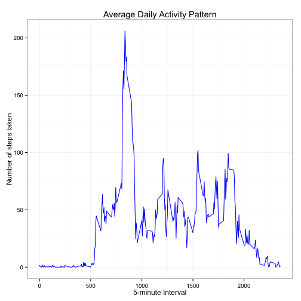

Reproducible Research: Peer Assessment 1
==========================================
by **Chuming Chen** (March 11, 2015)

## Introduction

The goal of this assignment is to practice the steps involved in creating Reproducible Research. The assignment makes use of data from a personal activity monitoring device to answer a set of questions described in details below. The assignment is required to be completed in a **single R markdown** document that can be processed by knitr and be transformed into an HTML file. 

The assignment is based on the Fork/clone of the instructor's GitHub repository created for [this assignment](http://github.com/rdpeng/RepData_PeerAssessment1). The final submission consists of the URL to cloned GitHub repository and the SHA-1 commit ID for the repository state.

## Data

The dataset for this assignment is included in the cloned GitHub repository.

* Dataset: [Activity monitoring data](https://d396qusza40orc.cloudfront.net/repdata%2Fdata%2Factivity.zip) [52K]

The variables included in this dataset are:

* **steps**: Number of steps taking in a 5-minute interval (missing
    values are coded as `NA`)

* **date**: The date on which the measurement was taken in YYYY-MM-DD
    format

* **interval**: Identifier for the 5-minute interval in which
    measurement was taken


The dataset is stored in a comma-separated-value (CSV) file and there
are a total of 17,568 observations in this
dataset.


## Set up R environment
1. Set the R working directory to cloned local GitHub repository.

2. Load required libraries.


```r
library(knitr)
library(ggplot2)
```

3. Set up knitr global options.

Set up some global options which will be applicable to every R code chunks that are different from the defaults. Since the assignment is a peer assessement, so all the R codes are available for review.


```r
opts_chunk$set(echo = TRUE)
```


## Assignment Questions and Answers

### Loading and preprocessing the data

1. Unzip the zipped data file ("activity.zip") and load it into R.


```r
unzip("activity.zip")
rawData <- read.csv("activity.csv", header=T, quote="\"", sep=",")
```

2. Convert the "date" column in the data into type of date.


```r
rawData$date <- as.Date(rawData$date) 
```

3. Check the data loaded.


```r
head(rawData)
```

```
##   steps       date interval
## 1    NA 2012-10-01        0
## 2    NA 2012-10-01        5
## 3    NA 2012-10-01       10
## 4    NA 2012-10-01       15
## 5    NA 2012-10-01       20
## 6    NA 2012-10-01       25
```

```r
dim(rawData)
```

```
## [1] 17568     3
```

### What is mean total number of steps taken per day?

1. Create a new data set ignoring the missing values in the dataset.


```r
data.noNAs <- na.omit(rawData)
```

2. Check the new data set created.


```r
head(data.noNAs)
```

```
##     steps       date interval
## 289     0 2012-10-02        0
## 290     0 2012-10-02        5
## 291     0 2012-10-02       10
## 292     0 2012-10-02       15
## 293     0 2012-10-02       20
## 294     0 2012-10-02       25
```

```r
dim(data.noNAs)
```

```
## [1] 15264     3
```
3. Create a data.frame of the total number of steps taken each day.


```r
stepsTakenPerDay <- aggregate(steps ~ date, data.noNAs, sum)
colnames(stepsTakenPerDay) <- c("date", "steps")
head(stepsTakenPerDay)
```

```
##         date steps
## 1 2012-10-02   126
## 2 2012-10-03 11352
## 3 2012-10-04 12116
## 4 2012-10-05 13294
## 5 2012-10-06 15420
## 6 2012-10-07 11015
```

```r
dim(stepsTakenPerDay)
```

```
## [1] 53  2
```

4. Make a histogram of the total number of steps taken each day.


```r
hist(stepsTakenPerDay$steps, breaks=20, main="Histogram of the total number of steps taken per day", xlab="Total steps per day")
```

 

5. Calculate and report the mean and median total number of steps taken per day.


```r
meanStepsTakenPerDay <- sprintf("%.3f", mean(stepsTakenPerDay$steps))
meanStepsTakenPerDay
```

```
## [1] "10766.189"
```

The mean toatl number of steps take per day is **10766.189**.


```r
medianStepsTakenPerDay <- sprintf("%.3f", median(stepsTakenPerDay$steps))
medianStepsTakenPerDay
```

```
## [1] "10765.000"
```

The median toatl number of steps take per day is **10765.000**.

## What is the average daily activity pattern?

1. Calculate the average steps for each of 5-minute interval.


```r
meanStepsPerFiveMinutesInterval <- aggregate(data.noNAs$steps, by = list(interval = data.noNAs$interval), FUN=mean)
colnames(meanStepsPerFiveMinutesInterval) <- c("interval", "meanSteps")
head(meanStepsPerFiveMinutesInterval)
```

```
##   interval meanSteps
## 1        0   1.71698
## 2        5   0.33962
## 3       10   0.13208
## 4       15   0.15094
## 5       20   0.07547
## 6       25   2.09434
```


2. Make a time series plot (i.e. type = "l") of the 5-minute interval (x-axis) and the average number of steps taken, averaged across all days (y-axis)


```r
ggplot(meanStepsPerFiveMinutesInterval, aes(x=interval, y=meanSteps))+   
        geom_line(color="blue") +  
        labs(title="Average Daily Activity Pattern", x="5-minute Interval", y="Number of steps taken") +  
        theme_bw()
```

 

3. Which 5-minute interval, on average across all the days in the dataset, contains the maximum number of steps?


```r
meanStepsPerFiveMinutesInterval[meanStepsPerFiveMinutesInterval$meanSteps == max(meanStepsPerFiveMinutesInterval$meanSteps),]
```

```
##     interval meanSteps
## 104      835     206.2
```

According to the calculation above, the **104th** 5-minute interval contains the maximum number of steps, the interval corresponds to **8:35 am** in time.


## Imputing missing values

There are a number of days/intervals where there are missing values (coded as NA). The presence of missing days may introduce bias into some calculations or summaries of the data.

1. Calculate and report the total number of missing values in the dataset (i.e. the total number of rows with NAs)


```r
totalNAs <- sum(is.na(rawData$steps))
totalNAs
```

```
## [1] 2304
```

The total number of rows with NAs in the raw data is **2304**.

2. Devise a strategy for filling in all of the missing values in the dataset. The strategy does not need to be sophisticated. For example, you could use the mean/median for that day, or the mean for that 5-minute interval, etc.

My strategy is to replace the missing values (NAs) by the mean for that 5-minute interval.


```r
newData <- rawData

for( i in 1:nrow(rawData)) {
        if(is.na(rawData$steps[i])) {
                newData$steps[i] <- as.numeric(meanStepsPerFiveMinutesInterval[meanStepsPerFiveMinutesInterval$interval == rawData$interval[i], ]$meanSteps)
        }
}
```

Check the new dataset where the missing values (NAs) have been replaced with mean for that 5-minute interval.


```r
head(newData)
```

```
##     steps       date interval
## 1 1.71698 2012-10-01        0
## 2 0.33962 2012-10-01        5
## 3 0.13208 2012-10-01       10
## 4 0.15094 2012-10-01       15
## 5 0.07547 2012-10-01       20
## 6 2.09434 2012-10-01       25
```

```r
dim(newData)
```

```
## [1] 17568     3
```

```r
sum(is.na(newData))
```

```
## [1] 0
```

We can see the new dataset that is equavalent to the orignal dataset but with the missing data filled in.


3. Make a histogram of the total number of steps taken each day, and calculate and report the mean and median total number of steps taken per day. Do these values differ from the estimates from the first part of the assignment? What is the impact of imputing missing data on the estimates of the total daily number of steps?

1). Make a histogram of the total number of steps take each day using new dataset.


```r
newStepsTakenPerDay <- aggregate(steps ~ date, newData, sum)
colnames(newStepsTakenPerDay) <- c("date", "steps")
head(newStepsTakenPerDay)
```

```
##         date steps
## 1 2012-10-01 10766
## 2 2012-10-02   126
## 3 2012-10-03 11352
## 4 2012-10-04 12116
## 5 2012-10-05 13294
## 6 2012-10-06 15420
```

```r
hist(newStepsTakenPerDay$steps, breaks=20, main="Histogram of the total number of steps taken per day (NAs Imputed)", xlab="Total steps per day")
```

 

2). Calculate and report the mean and median total number of steps taken per day using new dataset.


```r
newMeanStepsTakenPerDay <- sprintf("%.3f", mean(newStepsTakenPerDay$steps))
newMeanStepsTakenPerDay
```

```
## [1] "10766.189"
```

The mean toatl number of steps take per day using new dataset is **10766.189**.


```r
newMedianStepsTakenPerDay <- sprintf("%.3f", median(newStepsTakenPerDay$steps))
newMedianStepsTakenPerDay
```

```
## [1] "10766.189"
```

The median toatl number of steps take per day using new dataset is **10766.189**.

3). Do these values differ from the estimates from the first part of the assignment?

For the total number of steps taken per day calcuated using raw dataset: 

        Mean: 10766.189  
        Median: 10765.000        
For the total number of steps taken per day calcuated using dataset with missing values (NAs) replaced by the mean for that 5-minute interval:

        Mean: 10766.189  
        Median: 110766.189  

According to the comparison above, we can see the mean and median of the total number of steps taken per day are not really different from the first part of the assignment.


4). What is the impact of imputing missing data on the estimates of the total daily number of steps?

Imputing missing data does not change the overall distribution of the total daily number of steps. However, the peak of the distribution is increased. Since the distribution is not skewed and is still a normal distribution, imputing missing data does not have significant impact on our estimates of the total daily number of steps.


## Are there differences in activity patterns between weekdays and weekends?

For this part the weekdays() function may be of some help here. Use the dataset with the filled-in missing values for this part.

1. Create a new factor variable in the dataset with two levels – “weekday” and “weekend” indicating whether a given date is a weekday or weekend day.


```r
dayOfWeek <- as.factor(ifelse(weekdays(newData$date) %in% c("Saturday","Sunday"),"weekend", "weekday"))
newData$dayOfWeek <- dayOfWeek
```


2. Make a panel plot containing a time series plot (i.e. type = "l") of the 5-minute interval (x-axis) and the average number of steps taken, averaged across all weekday days or weekend days (y-axis). See the README file in the GitHub repository to see an example of what this plot should look like using simulated data.

1). Create a function that takes 5-minute intervals and the average number of steps taken, averaged across all weekday days or weekend days.


```r
meanDayOfWeekSteps <- function(data, dayOfWeek) {
        avgDayOfWeekSteps <- aggregate(data$steps, by = list(interval = data$interval), FUN=mean)
        avgDayOfWeekSteps$dayOfWeek <- rep(dayOfWeek, nrow(avgDayOfWeekSteps))
        
        colnames(avgDayOfWeekSteps ) <- c("interval", "meanSteps", "dayOfWeek")
        avgDayOfWeekSteps
}
```

2). Create mean number of steps taken averaged across weekends and check result.


```r
weekendData <- subset(newData, dayOfWeek %in% c("weekend"))
weekendSteps <- meanDayOfWeekSteps(weekendData, "weekend")
head(weekendSteps)
```

```
##   interval meanSteps dayOfWeek
## 1        0  0.214623   weekend
## 2        5  0.042453   weekend
## 3       10  0.016509   weekend
## 4       15  0.018868   weekend
## 5       20  0.009434   weekend
## 6       25  3.511792   weekend
```

```r
dim(weekendSteps)
```

```
## [1] 288   3
```
3). Create mean number of steps taken averaged across weekdays and check result.


```r
weekdayData <- subset(newData, dayOfWeek %in% c("weekday"))
weekdaySteps <- meanDayOfWeekSteps(weekdayData, "weekday")
head(weekdaySteps)
```

```
##   interval meanSteps dayOfWeek
## 1        0   2.25115   weekday
## 2        5   0.44528   weekday
## 3       10   0.17317   weekday
## 4       15   0.19790   weekday
## 5       20   0.09895   weekday
## 6       25   1.59036   weekday
```

```r
dim(weekdaySteps)
```

```
## [1] 288   3
```

4). Create combined data set and check result.


```r
meanDayOfWeekTotalSteps <- rbind(weekendSteps, weekdaySteps)
head(meanDayOfWeekTotalSteps)
```

```
##   interval meanSteps dayOfWeek
## 1        0  0.214623   weekend
## 2        5  0.042453   weekend
## 3       10  0.016509   weekend
## 4       15  0.018868   weekend
## 5       20  0.009434   weekend
## 6       25  3.511792   weekend
```

```r
dim(meanDayOfWeekTotalSteps)
```

```
## [1] 576   3
```

5). Make a panel plot containing a time series plot (i.e. type = "l") of the 5-minute interval (x-axis) and the average number of steps taken, averaged across all weekday days or weekend days (y-axis).


```r
ggplot(meanDayOfWeekTotalSteps, aes(x=interval, y=meanSteps)) + 
        geom_line(color="blue") + 
        facet_wrap(~ dayOfWeek, nrow=2, ncol=1) +
        labs(x="5-minute Interval", y="Total number of steps taken") +
        theme_bw()
```

 

#### Conclusion:

According to the panel plot shown above, the activity patterns between weekdays and weekends are different. Overall, the activities over the weekends are more intense than weekdays. 
